# Exercise 2: Migrate the Application Database

Duration: 60 minutes

In this exercise you will migrate the application database from the on-premises Hyper-V virtual machine to a new database hosted in the Azure SQL Database service. You will use the Azure Database Migration Service to complete the migration, which uses the Microsoft Data Migration Assistant for the database assessment and schema migration phases.

## Task 1: Microsoft.DataMigration resource provider check

Prior to using the Azure Database Migration Service, the resource provider **Microsoft.DataMigration** must be registered in the target subscription. Foll

1. Open the Azure Portal and navigate to ```Subscriptions```. If prompted, log in using your Azure subscription credentials provided. Select the Subscription, within it find the **Resource Providers** option and find the **Microsoft.DataMigration** resource provider. It should be marked as **registered** but if its not use the **Register** link above to register it.

    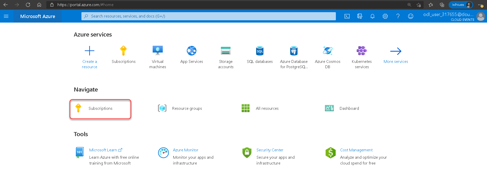

    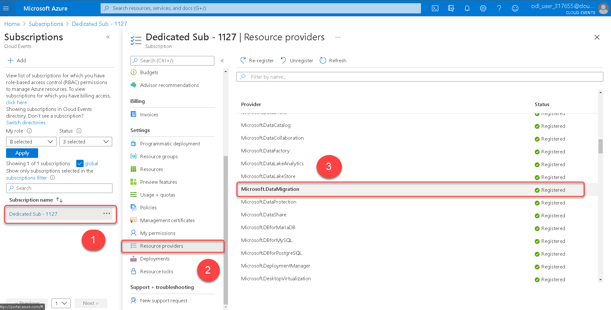

### Task 1 summary

In this task you have confirmed the **Microsoft.DataMigration** resource provider is registered  with your subscription. This resource provider is required to use the Azure Database Migration Service.

## Task 2: Create an Azure SQL Database

In this task you will create a new Azure SQL database to migrate the on-premises database to.

> **Note**: This lab focuses on simplicity to teach the participant the technical tools required. In the , more consideration should go into the long-term plan prior to creating the first DB. For instance: Will this DB live in an Azure landing zone? Who will operate this environment post-migration? What policies are in place that the migration team should be aware of prior to migration? These landing zone and operating model related topics are covered in the Cloud Adoption Framework’s Ready methodology. You don’t need to deviate from the script, but be familiar with the four-step process in that methodology, so you can field those types of a questions if they come up in the lab.

1. Open the Azure portal at https://portal.azure.com and log in using your subscription credentials if it's not still up.

1. Expand the portal's left navigation by selecting **Show portal menu** in the top left then select **+ Create a resource**, then select **Databases**, then select **SQL Database**.

    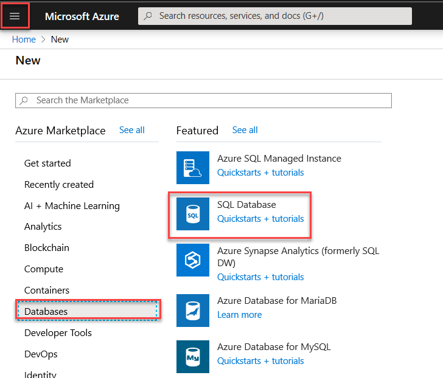

1. The **Create SQL Database** blade opens, showing the **Basics** tab. Complete the form as follows:

    - Subscription: **Select your subscription**.

    - Resource group: (select existing) **SmartHotelDBRG**

    - Database name: **smarthoteldb**

    - Server: Select **Create new** and fill in the New server blade as follows then select **OK**:

        - Server name: **smarthoteldb<inject key="DeploymentID" enableCopy="false" />**

        - Server admin login: **demouser**

        - Password: **<inject key="SmartHotelHost Admin Password" />**

        - Location: **IMPORTANT: For most users, select the same region you used when you started your lab - this makes migration faster. If you are using an Azure Pass subscription, choose a different region to stay within the Total Regional vCPU limit.**

    > **Note**: You can verify the location by opening another browser tab, navigating to https://portal.azure.com and selecting Virtual Machines on the left navigation. Use the same region as the **SmartHost<inject key="DeploymentID" enableCopy="false" />** virtual machine.

    

    - Want to use SQL elastic pool?: **No**

    - Compute + storage: **Standard S0**

    - Backup storage redundancy: **Locally-redundant backup storage**

    > **Note**: To select the **Standard S0** database tier, select **Configure database**, then **Looking for basic, standard, premium?**, select **Standard** and select **Apply**.

    

    

     The final screenshot will look like this:

      

1. Select **Next: Networking >** to move to the **Networking** tab. Select **Public Endpoint** option and **Yes** to both Firewall rule choices, as show in the illustration below.

    > **Note**: In a production scenario, you would select either **No access** or **Private Endpoint** being a more secure choice.

    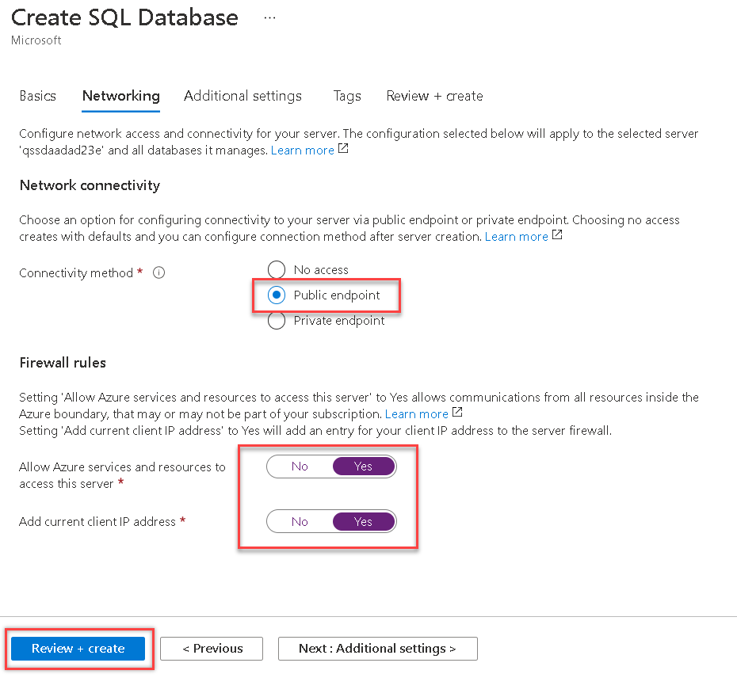

1. Select **Review + Create**, then select **Create** to create the database. Wait for the deployment to complete.

1. Once complete, navigate to the database  **smarthoteldb**. From the Overview page, copy the server name of the database and keep this in a text editor as we will be using this further.

### Task 2 summary

In this task you created an Azure SQL Database running on an Azure SQL Database Server.

## Task 3: Create the Database Migration Service

In this task you will create an Azure Database Migration Service resource. This resource is managed by the Microsoft.DataMigration resource provider which you registered in task 1.

> **Note**: The Azure Database Migrate Service (DMS) requires network access to your SQL Server database (simulated as on-premises) to retrieve the data for transfer. To achieve this access, the DMS is deployed into an Azure VNet. In an actual production scenario, you would require connecting to it securely to your database, for example by using a Site-to-Site VPN or ExpressRoute connection.
>
> In this lab, the 'on-premises' environment is simulated by a Hyper-V host running in an Azure VM. This VM is deployed to the 'smarthotelvnet' VNet. Hence for this lab, the DMS will be deployed to this VNET (called 'smarthotelvnet').

1. In the Azure portal, expand the portal's left navigation and select **+ Create a resource**, search for **Azure Database Migration Service** and select it.

1. On the **Azure Database Migration Service** blade, select **Create**.

    

1. In the **Create Migration Service** blade, on the **Basics** tab, enter the following values:

    - Subscription: **Select your Azure subscription**.
  
    - Resource group: **AzureMigrateRG**
  
    - Service Name: **SmartHotelDBMigration**
  
    - Location: **Choose the same region as the SmartHotel host**.

    - Service mode: **Azure**
  
    - Pricing tier: **Standard: 1 vCore**

    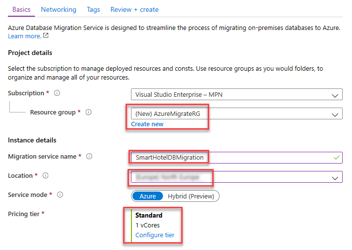

1. Select **Next: Networking** to move to the **Networking** tab, and select the **smarthostvnet/host..** virtual network and subnet in the **SmartHotelHostRG** resource group.
   
    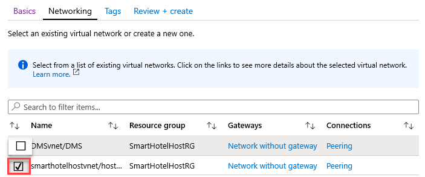

1. Select **Review + create**, followed by **Create**.

> **Note**: Creating a new migration service can take around 20 minutes. You can continue to the next task without waiting for the operation to complete. You will not use the Database Migration Service until task 5.

### Task 3 summary

In this task you created a new Azure Database Migration Service resource.

## Task 4: Assess the on-premises database using Data Migration Assistant

In this task you will use Microsoft Data Migration Assistant (DMA) to assess the on-premises database. DMA is integrated with Azure Migrate providing a single hub for assessment and migration tools.

1. Return to the **Azure Migrate** blade in the Azure portal. Select the **Overview** panel, then select **Assess and migrate databases**.

    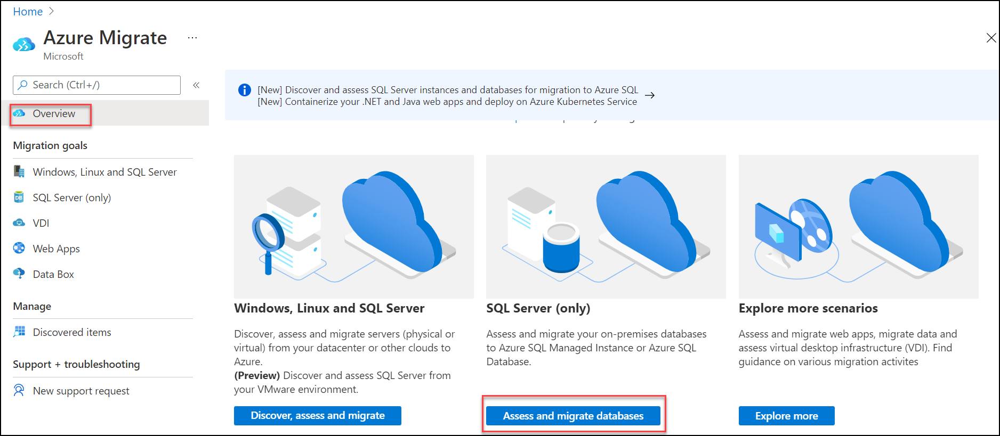  

1. Under **Assessment tools**, click on **Click here** link to add a tool, then select **Azure Migrate: Database Assessment**, then select **Add tool**

    
    
    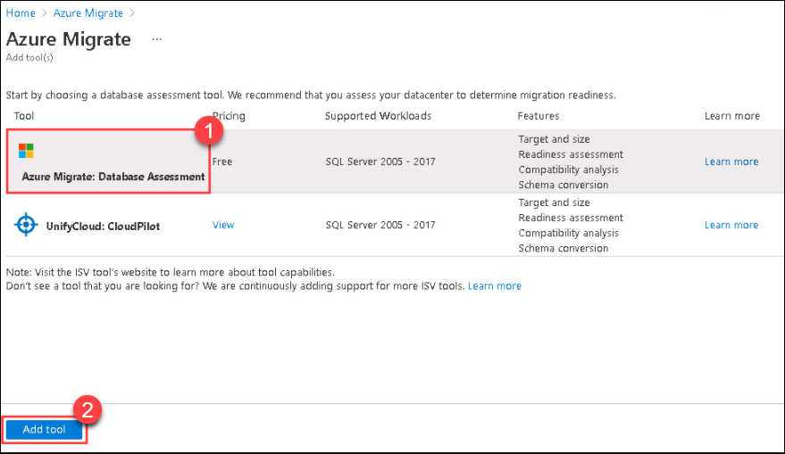

1. Under **Migration tool**, click on **Click here** link to add a tool, then select **Azure Migrate: Database Migration**, then select **Add tool**.

    
    
    

1. Once the tools are installed in Azure Migrate, the portal should show the **Azure Migrate - SQL Server(only)** blade. 


1.  Launch **Microsoft Data Migration Assistant** using the desktop icon .

     
  
1.  In the Data Migration Assistant, select the **+ New** icon.  Fill in the project details as follows:

    - Project type: **Assessment**
  
    - Project name: **SmartHotelAssessment**
  
    - Assessment type: **Database Engine**
  
    - Source server type: **SQL Server**
  
    - Target server type: **Azure SQL Database**
     
1. Select **Create** to create the project.

    

1. On the **Options** tab select **Next**.

1. On the **Select sources** page, in the **Connect to a server** dialog box, provide the connection details to the SQL Server, and then select **Connect**.

    - Server name: **192.168.0.6**
  
    - Authentication type: **SQL Server Authentication**
  
    - Username: **sa**
  
    - Password: **<inject key="SmartHotelHost Admin Password" />**
  
    - Encrypt connection: **Checked**
  
    - Trust server certificate: **Checked**

    

1. In the **Add sources** dialog box, select **SmartHotel.Registration**, then select **Add**.

    

1. Select **Start Assessment** to start the assessment. 

    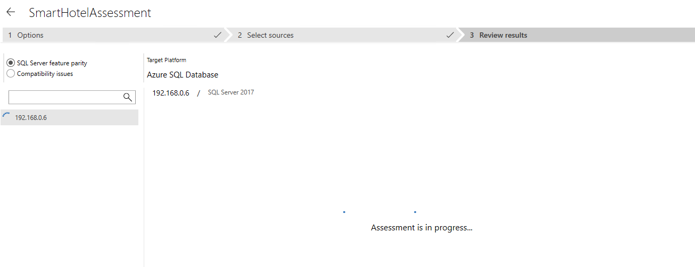

1. **Wait** for the assessment to complete, and review the results. The results should show two unsupported features, **Service Broker feature is not supported in Azure SQL Database** and **Azure SQL Database does not support EKM and Azure Key Vault integration**. For this migration, you can ignore these issues.

    > **Note**: For Azure SQL Database, the assessments identify feature parity issues and migration blocking issues.

    >- The SQL Server feature parity category provides a comprehensive set of recommendations, alternative approaches available in Azure, and mitigating steps to help you plan the effort into your migration projects.

    >- The Compatibility issues category identifies partially supported or unsupported features that reflect compatibility issues that might block migrating on-premises SQL Server database(s) to Azure SQL Database. Recommendations are also provided to help you address those issues.

1. Select **Upload to Azure Migrate** to upload the database assessment to your Azure Migrate project (this button may take a few seconds to become enabled).

    

1. On the **Connect to Azure** blade, select **Azure** from the dropdown on the right then select **Connect**. Enter your Azure credentials when prompted. Select your **Subscription** and **Azure Migrate Project** using the dropdowns, then select **Upload**. Once the upload is complete, select **OK** to dismiss the notification.

    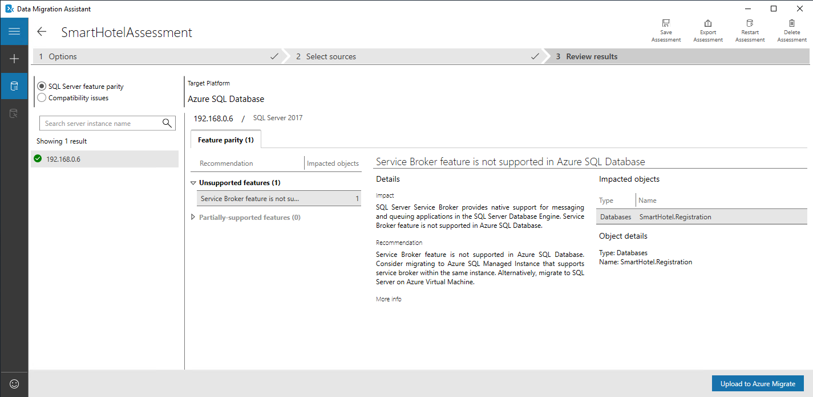

1. Return to the **Azure Migrate - SQL Server(only)** blade in the Azure portal. Refreshing the page should now show the assessed database.

    

### Task 4 summary

In this task you used Data Migration Assistant to assess an on-premises database for readiness to migrate to Azure SQL, and uploaded the assessment results to your Azure Migrate project. The DMA is integrated with Azure Migrate providing a single hub for assessment and migration tools.

## Task 5: Create a DMS migration project

In this task you will create a Migration Project within the Azure Database Migration Service (DMS). This project contains the connection details for both the source and target databases.

In subsequent tasks, you will use this project to migrate both the database schema and the data itself from the on-premises SQL Server database to the Azure SQL Database.

1. Towards the end of Task 2, you would have copied the server name for its use in this task. If not, in the Azure portal, navigate to the **SmartHotelDBRG** resource group, and then to the database server **smarthoteldb<inject key="DeploymentID" enableCopy="false" />**. From the Overview page, copy the server name of the database and keep this in a text editor as we will be using this further.

1. Check that the Database Migration Service resource you created in task 3 has completed provisioning. You can check the deployment status from the **Deployments** pane in the **AzureMigrateRG** resource group blade.

    

1. Navigate to the Database Migration Service **SmartHotelDBMigration** resource blade in the **AzureMigrateRG** resource group and select **+ New Migration Project**.

    

1. the **New migration project** blade, enter **DBMigrate** as the project name. Leave the source server type as **SQL Server** and target server type as **Azure SQL Database**. Select **Choose type of activity** and select **Create project only**. Select **Save** then select **Create**.

    

1. The Migration Wizard opens, showing the **Select source** step. Complete the settings as follows, then select **Next: Select databases**.

    - Source SQL Server instance name: **10.0.0.4**
  
    - Authentication type: **SQL Authentication**
  
    - User Name: **sa**
  
    - Password: **<inject key="SmartHotelHost Admin Password" />**

    - Encryption connection: **Checked**
  
    - Trust server certificate: **Checked**

    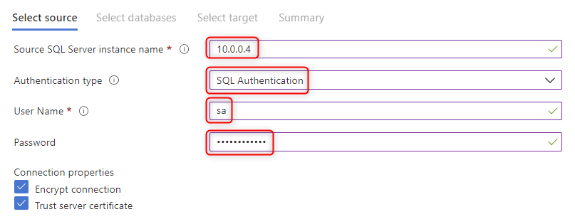

    > **Note**: The DMS service connects to the Hyper-V host, which has been pre-configured with a NAT rule to forward incoming SQL requests (TCP port 1433) to the SQL Server VM. In a real-world migration, the SQL Server VM would most likely have its own IP address on the internal network, via an external Hyper-V switch.
    >
    > The Hyper-V host is accessed via its private IP address (10.0.0.4). The DMS service accesses this IP address over the peering connection between the DMS VNet and the SmartHotelHost VNet. This simulates a VPN or ExpressRoute connection between a DMS VNet and an on-premises network.

1. In the **Select databases** step, the **Smarthotel.Registration** database should already be selected. Select **Next: Select target**.

    

1. Complete the **Select target** step as follows, then select **Next: Summary**:

    - Target server name: **Paste the server name value you copied earlier, {something}.database.windows.net**.
  
    - Authentication type: **SQL Authentication**
  
    - User Name: **demouser**
  
    - Password: **<inject key="SmartHotelHost Admin Password" />**
  
    - Encrypt connection: **Checked**

    

    > **Note**: You can find the target server name in the Azure portal by browsing to your database.

    

1. At the **Project summary** step, review the settings and select **Save project** to create the migration project.

    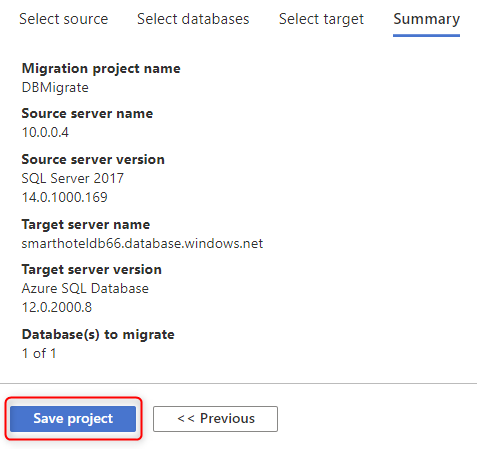

### Task 5 summary

In this task you created a Migration Project within the Azure Database Migration Service. This project contains the connection details for both the source and target databases. A private endpoint was used to avoid exposing the database on a public IP address.

## Task 6: Migrate the database schema

In this task you will use the Azure Database Migration Service to migrate the database schema to Azure SQL Database. This step is a prerequisite to migrating the data itself.

The schema migration will be carried out using a schema migration activity within the migration project created in task 5.

1. Following task 5, the Azure portal should show a blade for the DBMigrate DMS project. Select **+ New Activity** and select **Schema only migration** from the drop-down.

    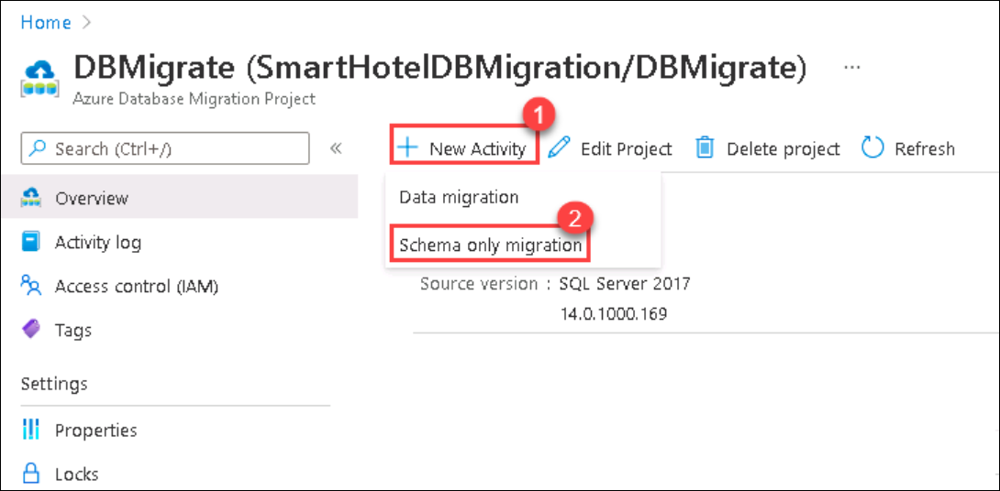

2. The Migration Wizard is shown. Most settings are already populated from the existing migration project. At the **Select source** step, re-enter the source database password **<inject key="SmartHotelHost Admin Password" />**, then select **Next: Select target**.

    

3. At the **Select target** step, enter the password **<inject key="SmartHotelHost Admin Password" />** and select **Next: Select database and schema**.

    

4. At the **Select database and schema** step, check that the **SmartHotel.Registration** database is selected. Under **Target Database** select **smarthoteldb** and under **Schema Source** select **Generate from source**. Select **Next: Summary**.

    

5. At the **Summary** step, enter **SchemaMigration** as the **Activity name**. Select **Start migration** to start the schema migration process.

    

6. The schema migration will begin. Select the **Refresh** button and watch the migration progress, until it shows as **Completed**.

    

### Task 6 summary

In this task you used a schema migration activity in the Azure Database Migration Service to migrate the database schema from the on-premises SQL Server database to the Azure SQL database.

## Task 7: Migrate the on-premises data

In this task you will use the Azure Database Migration Service to migrate the database data to Azure SQL Database.

The schema migration will be carried out using an offline data migration activity within the migration project created in task 5.

1. Return to the Azure portal blade for your **DBMigrate** migration project in DMS. Select **+ New Activity** and select **Offline data migration** from the drop-down.

    

1. The Migration Wizard is shown. Most settings are already populated from the existing migration project. At the **Select source** step, re-enter the source database password **<inject key="SmartHotelHost Admin Password" />**, then select **Next: Select target**.

    

1. At the **Select databases** blade, select **SmartHotel.Registration** database then select **Next: Select target**.

    

1. At the **Select target** step, enter the password **<inject key="SmartHotelHost Admin Password" />** and select **Next: Map to target databases**.

    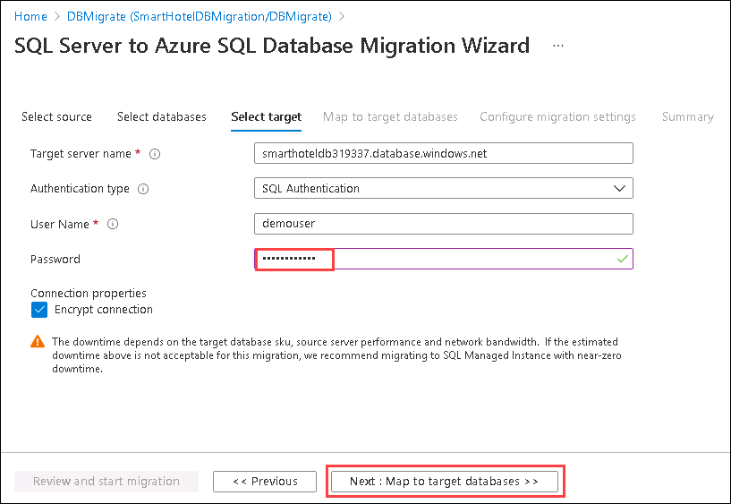

1. At the **Map to target databases** step, check the **SmartHotel.Registration** database. Under **Target Database** select **smarthoteldb**. Select **Next: Configure migration settings**.

    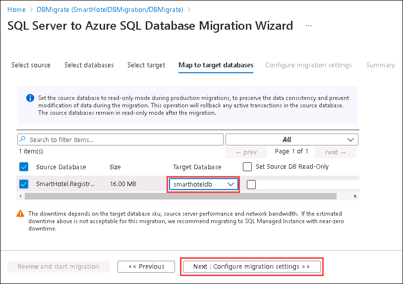

1. The **Configure migration settings** step allows you to specify which tables should have their data migrated. **Expand** the **SmartHotel.Registration 2 of 2** option and select the **Bookings** table (Make sure the **MigrationHistory** table is not checked) and select **Next: Summary**.

    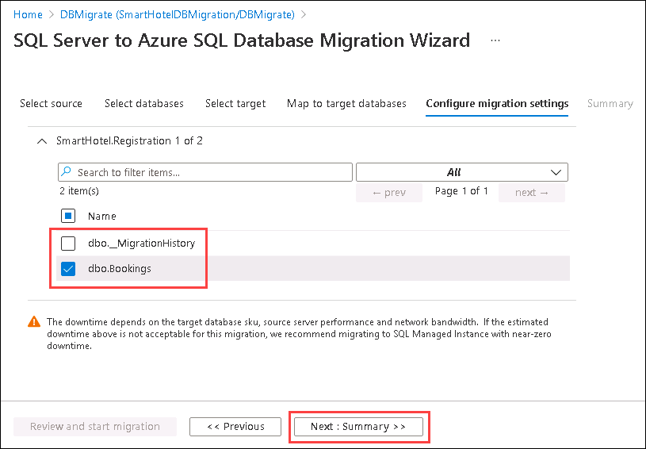

1. At the **Migration summary** step, enter **DataMigration** as the **Activity name**. Select **Start migration**.

    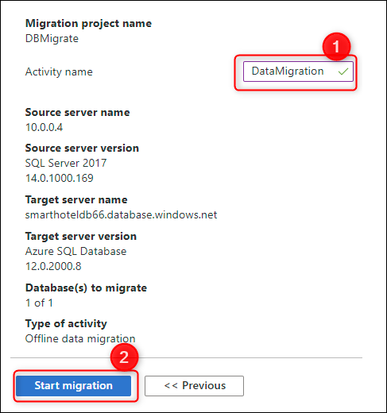

1. The data migration will begin. Select the **Refresh** button and watch the migration progress, until it shows as **Completed**.

    

### Task 7 summary

In this task you used an off-line data migration activity in the Azure Database Migration Service to migrate the database data from the on-premises SQL Server database to the Azure SQL database.

## Task 8: Re-point data connection in SmarthotelWEb to use the migrated Azure SQL database

In this task you will configure the Smart hotel web app to use the migrated Azure Database by updating  web.config file within using the connection string that points to the new Azure SQL database

1. Open Hyper-V manager and connect to **Smarthotelweb2**. Login as **Administrator** and Password **<inject key="SmartHotelHost Admin Password" />**. 

     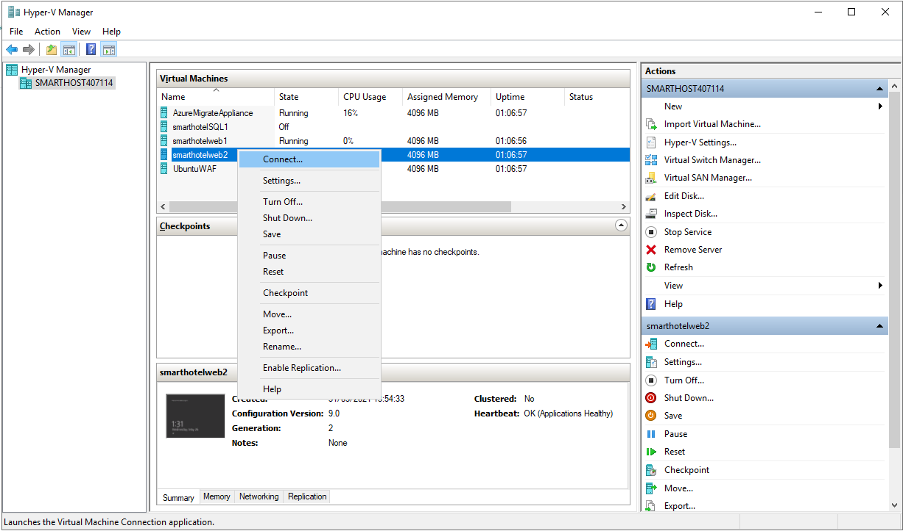 

1. Next, open File Explorer and navigate to the **C:\\inetpub\\SmartHotel.Registration.Wcf** folder. Double-select the **Web.config** file and open with Notepad.

1. Update the **DefaultConnection** setting to connect to your Azure SQL Database.

    You can find the connection string for the Azure SQL Database in the Azure portal. Navigate to the **SmartHotelDBRG** resource group, and then to the database **smarthoteldb** and  from the overview, select **Show database connection strings**.

     

    Copy the **ADO.NET** connection string, and paste into the web.config file on **smarthotelweb2** console window, replacing the existing connection string.  **Be careful not to overwrite the 'providerName' parameter which is specified after the connection string.**

    Set the password in the connection string to **<inject key="SmartHotelHost Admin Password" />**.

    

1. **Save** the `web.config` file and close the VM console.

1. Open Hyper-V manager and shutdown the SQL Server VM **smarthotelSQL1**
    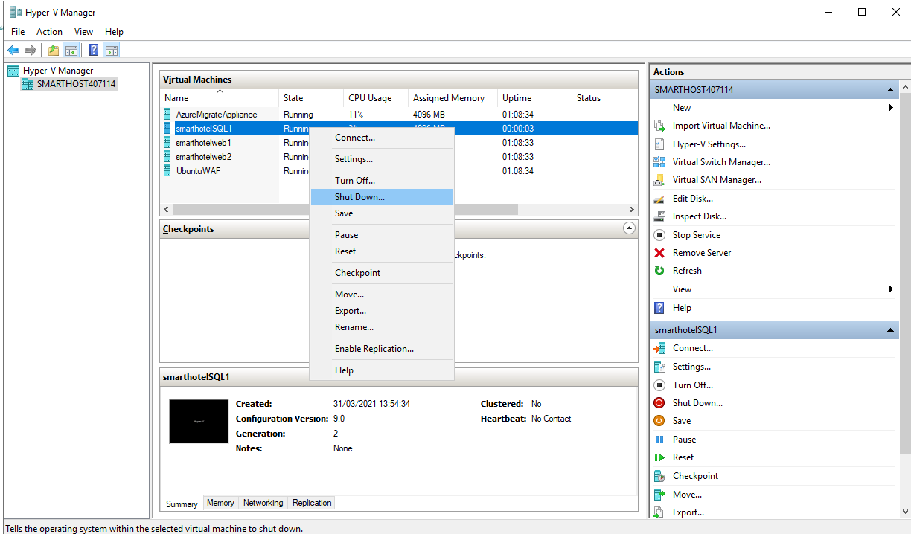

1. Open a new browser tab within Edge browser and navigate using the IP address **192.168.0.4** into the address bar. Verify that the SmartHotel360 application is now using the data from Azure SQL database.

    

### Task 8 summary

In this task you used configured the Web application to use the new Azure SQL database

## Exercise summary

In this exercise you migrated the application database from on-premises to Azure SQL Database. The Microsoft Data Migration Assistant was used for migration assessment, and the Azure Database Migration Service was used for schema migration and data migration.
